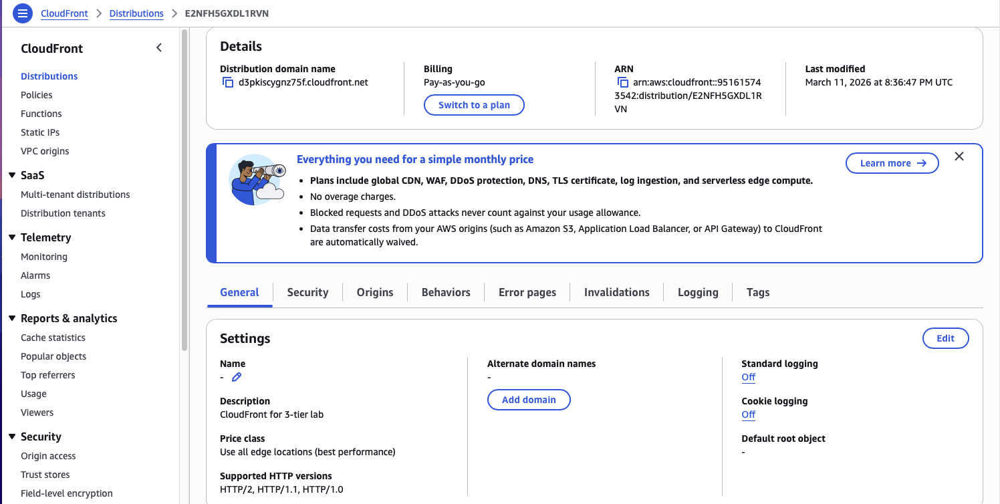
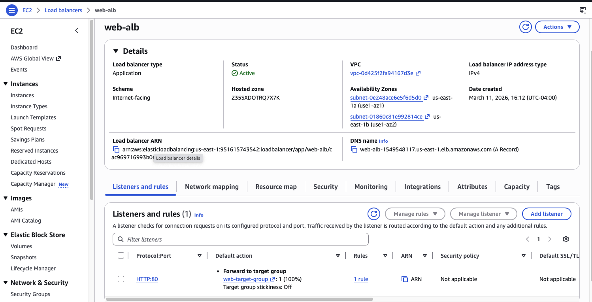
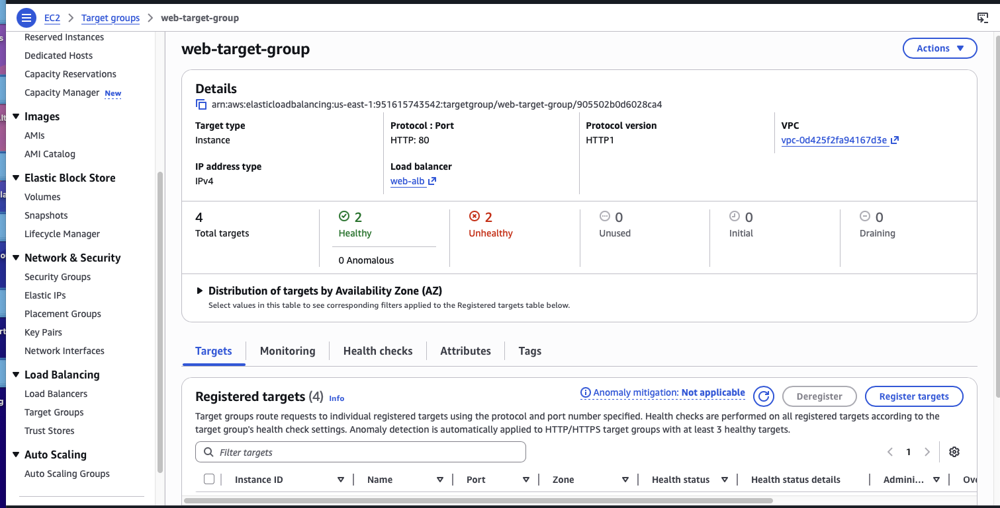
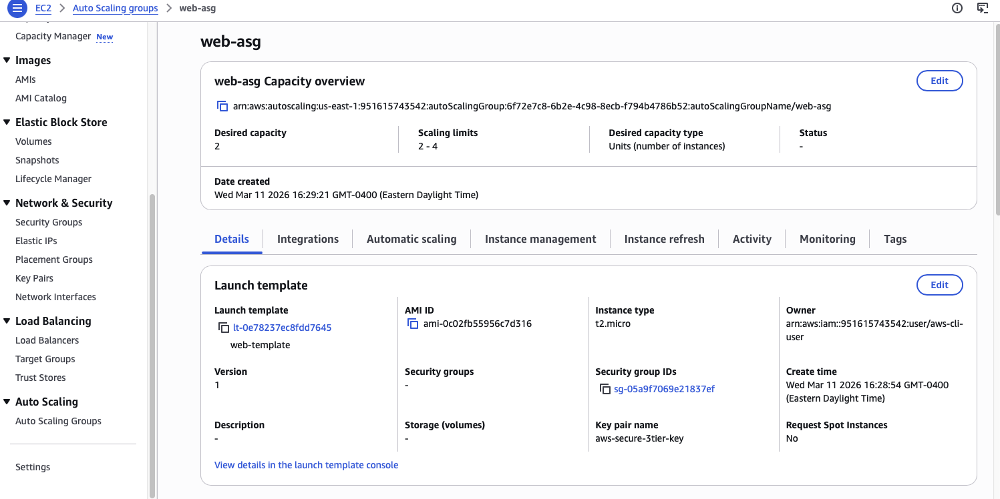
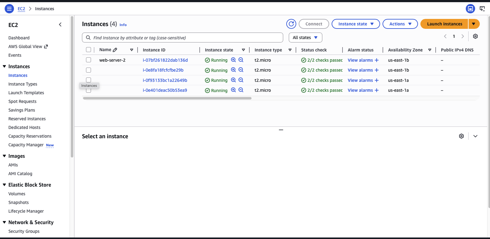
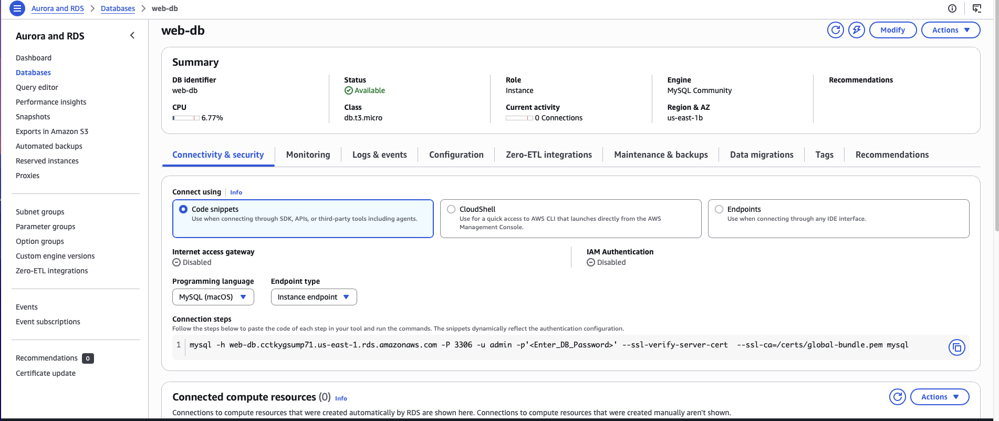
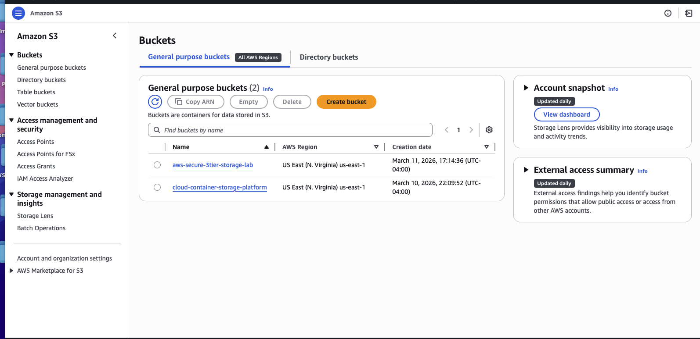
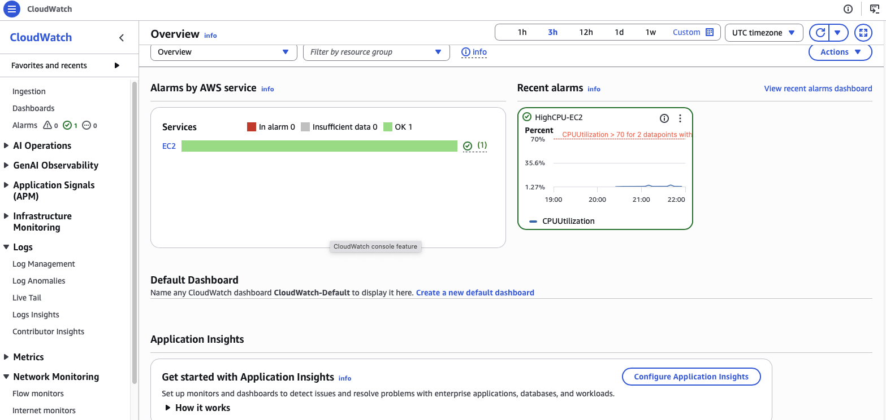

# AWS Secure 3-Tier Architecture

This project demonstrates a production-style **3-tier architecture on AWS** built using the AWS CLI.

## Architecture Overview

User → CloudFront → Application Load Balancer → EC2 Auto Scaling → RDS Database

## Architecture Layers

### Edge Layer
- Amazon CloudFront CDN

### Web Layer
- Application Load Balancer
- EC2 Auto Scaling Group

### Application Layer
- EC2 instances running Apache web server

### Data Layer
- Amazon RDS MySQL database

### Storage Layer
- Amazon S3 for logs, artifacts, and storage

### Monitoring Layer
- Amazon CloudWatch alarms and dashboard

## AWS Services Used

- Amazon VPC
- Amazon EC2
- EC2 Auto Scaling
- Application Load Balancer
- Amazon RDS
- Amazon S3
- Amazon CloudFront
- Amazon CloudWatch

## Features Implemented

- Multi-AZ architecture
- Load balancing
- Auto scaling
- CDN edge caching
- Database backend
- Centralized logging
- Monitoring and alarms

## Repository Structure

```
aws-secure-3tier-architecture
├── architecture-diagram
├── deployment-steps
├── screenshots
└── README.md
```

## Deployment Steps

Detailed deployment steps are documented here:

```
deployment-steps/aws-3tier-deployment.md
```

## Architecture Flow

```
User
 │
CloudFront
 │
Application Load Balancer
 │
Auto Scaling Group
 │
EC2 Application Servers
 │
RDS Database
 │
S3 Storage
 │
CloudWatch Monitoring
```


## Architecture Screenshots

Full infrastructure screenshots are available here:

[screenshots/architecture-screenshots.md](screenshots/architecture-screenshots.md)

This includes screenshots of:

- CloudFront Distribution
- Application Load Balancer
- Target Group Health
- Auto Scaling Group
- EC2 Instances
- RDS Database
- S3 Storage
- CloudWatch Dashboard


## Architecture Screenshots

### CloudFront Distribution


### Application Load Balancer


### Target Group Health


### Auto Scaling Group


### EC2 Instances


### RDS Database


### S3 Storage


### CloudWatch Monitoring


## Author
Cloud Architecture by Hari Sharma
